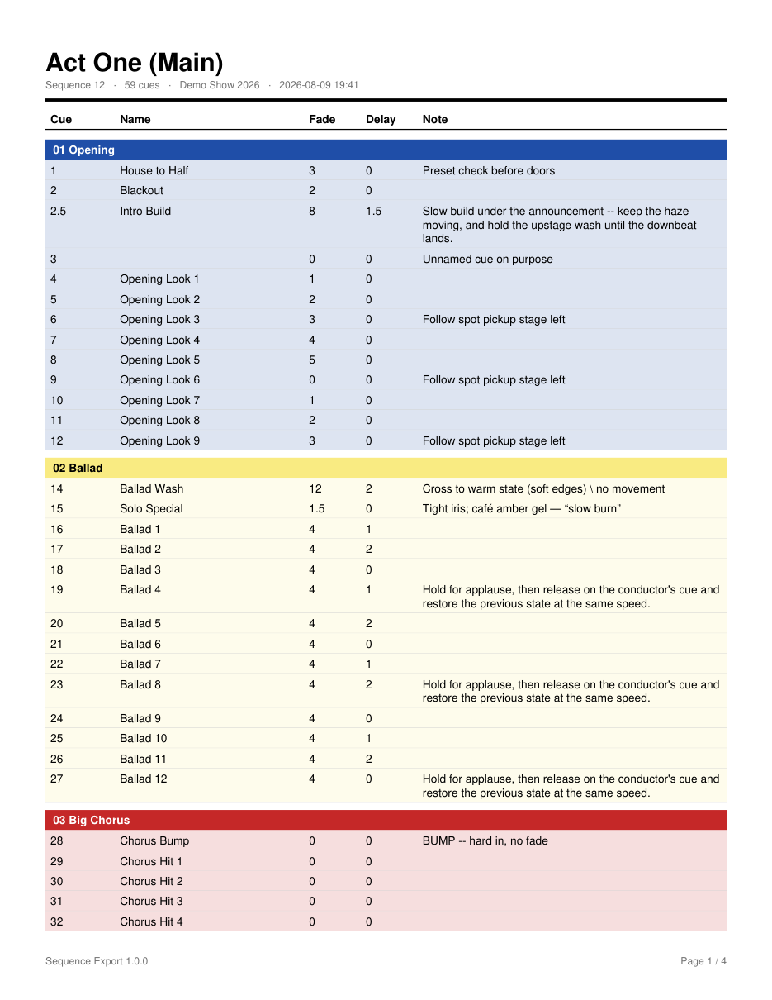

# GrandMA3 Sequence Export Plugin

Exports a grandMA3 sequence as a printable PDF cue sheet — cue number, name,
fade, delay and note — with the sequence name as the title and each cue's
**Appearance** color carried over so songs and sections stay visible at a glance.

Runs unchanged on a console or on onPC. No external tools, no dependencies:
the PDF bytes are generated in pure Lua, because MA3 ships no PDF library.



## What the export looks like

- Sequence name in **bold** at the top left, with a meta line underneath
  (sequence number, cue count, showfile, timestamp).
- A heavy separator bar, then the cue table.
- A **colored section band** every time the Appearance changes, labelled with the
  Appearance name. Band text flips between black and white automatically so a
  near-black or pale-yellow Appearance stays readable.
- Cue rows **tinted** with a light wash of their section color. Cues with no
  Appearance fall back to plain zebra striping.
- Long notes **word-wrap** and the row grows to fit. Page breaks repeat the
  column headers and re-draw the current section band marked `(cont.)`.

## Install

1. Copy **both** files into the plugins folder of your grandMA3 library:

   ```
   gma3_library/datapools/plugins/SequenceExport.xml
   gma3_library/datapools/plugins/SequenceExport.lua
   ```

   | Where | Path |
   |---|---|
   | USB stick (console) | `<USB>/gma3_library/datapools/plugins/` |
   | onPC, Windows | `C:\ProgramData\MALightingTechnology\gma3_library\datapools\plugins\` |
   | onPC, macOS | `~/MALightingTechnology/gma3_library/datapools/plugins/` |

   Both files must travel together — the XML is the plugin wrapper and points at
   the Lua file by name.

2. On the console or in onPC, open the **Plugins** pool, edit an empty pool
   slot, and **Import** `SequenceExport`. Pick the drive you copied the files to
   if you are importing from a USB stick.

3. The pool slot now runs the plugin when you tap it.

## Using it

Tap the plugin. Three dialogs, in order:

1. **Select** — a dropdown of every sequence in the current data pool, shown as
   `12 - Act One`. There is also a number field if you would rather type it; if
   you fill the field it wins over the dropdown.
2. **Confirm** — shows the sequence number, its name and how many cues will be
   exported. `Back` returns to the picker if it is the wrong one.
3. **Destination** — a dropdown of storage devices currently attached (removable
   drives listed first), plus an editable file name prefilled with
   `<Sequence Name>_<date>.pdf`. `Back` returns to the confirmation.

The PDF is written to the root of the chosen drive, and a final dialog shows the
full path.

## Configuration

Everything visual lives in the `CFG` table at the top of `SequenceExport.lua`:
page size, margins, font sizes, column widths, tint strength, and the luminance
cutoff that decides black-versus-white band text.

The page is **US Letter portrait** (612 × 792 pt). For A4, set
`pageWidth = 595`, `pageHeight = 842`. Column widths must sum to
`pageWidth - 2 * margin`.

## Known limitations

- **Multi-part cues** render as a single row using **part 1**'s fade and delay.
- Text is drawn with the base-14 Helvetica faces, which are **WinAnsi** only.
  Accented Latin, smart quotes, dashes and the like round-trip correctly;
  characters with no WinAnsi equivalent (CJK, Cyrillic) render as `?`.
- The PDF is **uncompressed** — larger files in exchange for zero dependencies.
- A note longer than a whole page is **clipped** with a trailing `...`, since a
  cue row is never split across pages.

## Development

The plugin can be exercised without a console. `dev/ma3_mock.lua` stands in for
the MA3 environment — handles that answer `Get(name, role)`, `Root()`,
`DataPool()`, and a scripted `MessageBox` — over a synthetic show built to
stress the layout.

```sh
cd dev
lua5.4 run_local.lua              # runs the plugin, writes dev/out/*.pdf
pip install pymupdf
python3 verify_pdf.py out/sample.pdf
```

`run_local.lua` asserts the text metrics, WinAnsi escaping, wrapping,
truncation, color helpers and the MA3 data layer, then performs four full
export runs: a multi-page sequence, a `Back`-navigation round trip, a
single-cue sequence, and a sequence with no cues.

`verify_pdf.py` re-opens the output — which only succeeds if the hand-computed
cross-reference byte offsets are correct — and checks pagination, page size,
expected text, that the title is the largest bold run in the top-left, and that
nothing overflows the margins.

### API notes

Property spellings have moved between MA3 releases, so every read goes through
a defensive `getProp` helper that tries `Get(name, Enums.Roles.Display)` first
and falls back to direct attribute access. An unreadable property yields a blank
cell rather than aborting the export. Two specifics worth knowing:

- Cue timing lives on the **cue part**, not the cue. `cue.cuefade` is `nil`;
  `CueFade` is internally `CueInFade`/`CueOutFade`, so only the display role
  returns the combined string the sequence sheet shows.
- Appearance colors come from `BackR` / `BackG` / `BackB` in the range **0–255**.

## License

MIT
